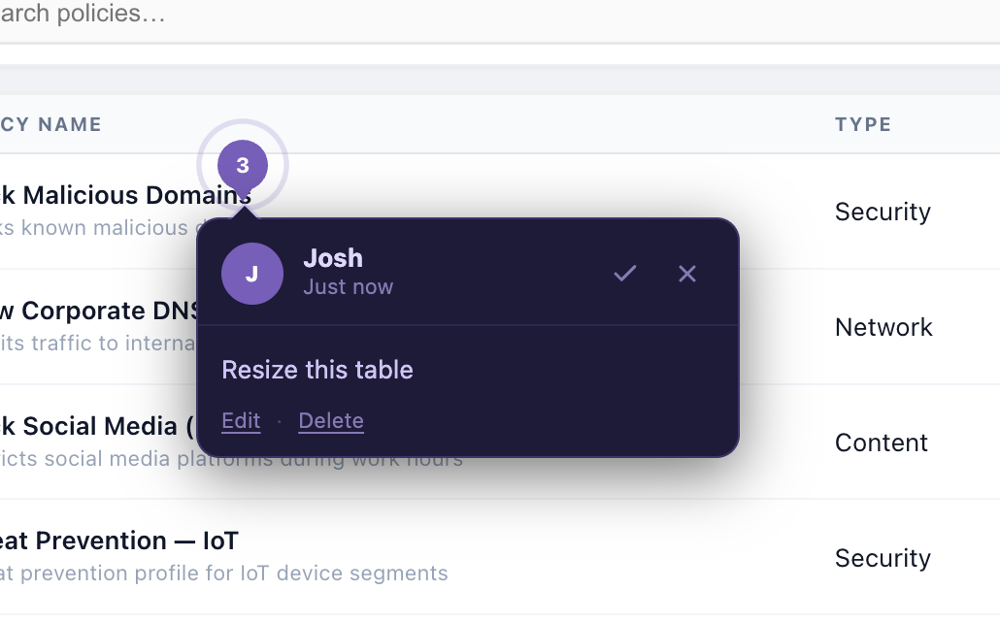

# Design Darts

Pin comments directly on HTML prototypes and collect stakeholder feedback — no install required for reviewers.

Design Darts packages your prototype into a single offline-ready HTML file with a comment overlay injected. Stakeholders open the file in any browser, click elements to drop comment pins, type feedback, and export a JSON file. You import that JSON to see every pin overlaid exactly where they left it.



---

## Install

```bash
claude plugin add https://github.com/joshuashane/design-darts
```

**If the plugin command doesn't find the skill** (Claude Code plugin support varies by version), the skill will automatically clone the tools to `~/.design-darts/` on first use — no manual setup needed. You can also run the CLI directly without any plugin installation:

```bash
# Clone once to a stable location
git clone --depth 1 https://github.com/joshuashane/design-darts.git ~/.design-darts

# Then bundle any prototype
node ~/.design-darts/packages/darts-bundle/bin/darts-bundle.js \
  --name "My Prototype Review" \
  --input ./my-prototype \
  --output my-prototype-review.html
```

---

## For designers — packaging a prototype

Once the plugin is installed, just tell Claude Code what you want:

> "share for review" · "ship for review" · "ready for review" · "send to stakeholders" · "share with client" · "package for review" · "add a comment layer" · "design darts" · "single file" · "shareable HTML"

Claude will detect your framework, build the prototype, inject the overlay, and produce a single `.html` file. It also generates reviewer instructions you can paste directly into Slack or email.

**Supported frameworks:** Vite · React (CRA) · Next.js · Angular · Storybook · SvelteKit · Nuxt · plain HTML

### Or run the CLI directly

```bash
node packages/darts-bundle/bin/darts-bundle.js \
  --name "Sprint 12 Review" \
  --input ./my-prototype \
  --output sprint-12-review.html
```

---

## For reviewers — leaving feedback

Open the `.html` file in any browser — no internet connection or account needed.

| Action | How |
|---|---|
| Enter comment mode | Press **C** (or click **Comment** in the toolbar) |
| Pin a comment | Click any element on the page |
| Submit | Press **Enter** (Shift+Enter for a new line) |
| Reposition a pin | Drag it to a new element |
| Resolve a comment | Click the ✓ on the pin or in the comments panel |
| Export feedback | Click **Export feedback** in the toolbar — saves a `.json` file |

Send the exported JSON file back to the designer.

---

## For designers — importing feedback

Open your review file, click **↑ Import** in the toolbar, and select the reviewer's JSON. All their pins appear overlaid at exactly where they clicked, with names and timestamps. You can import from multiple reviewers — Design Darts deduplicates automatically.

---

## Packages

| Package | Purpose |
|---|---|
| `darts-runtime` | In-browser comment overlay, compiled to a single IIFE |
| `darts-bundle` | CLI — inlines all assets as data URIs and injects the runtime |
| `darts-ingest` | CLI — merges feedback JSON files into a triage markdown report |
| `darts-vite-plugin` | Vite plugin — stamps source file + line on JSX elements so pins link to code |

---

## License

MIT — Copyright (c) 2026 Josh Stone
